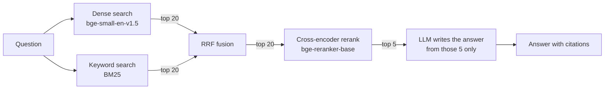

# Robotics Hybrid RAG

**Live demo: [robotics-rag.streamlit.app](https://robotics-rag.streamlit.app/)**
(free hosting: after a quiet spell the app sleeps, and the first visit then
rebuilds the search index, which takes a few minutes).

Ask a question about robot hardware or navigation software, such as *"What is
the I2C address of the MPU-6050 when AD0 is high?"*, and get an answer looked
up in the real datasheets and ROS 2 Nav2 docs, with a citation to the exact
page or section it came from. If the documents don't contain the answer, it
says so instead of guessing. Retrieval combines **semantic search** (good at
meaning) with **keyword search** (good at exact part codes like `A1M8` and
parameter names like `inflation_radius`), then a **cross-encoder reranker**
puts the best passages first. Everything except the final answer-writing step
runs locally on a CPU, for free.

## The app

`streamlit run app.py` opens a web app with three tabs:

- **💬 Ask:** a chat. Each answer cites its sources as `[n]` badges, and the
  passages the LLM read are one click away, with the question's key words
  highlighted.
- **⚖️ Compare modes:** one question through dense, hybrid and hybrid +
  rerank side by side. For test-set questions, passages that contain the
  answer are marked ✓, so you can watch keyword search rescue a question that
  semantic search misses.
- **📊 Evaluation:** the results below, as stat tiles and charts.

## Results

Measured on a hand-built test set of 85 questions covering all 32 documents
(44 that name the part code or parameter, 41 paraphrased), each with a
confirmed answer and the exact passage(s) in the documents that contain it
([eval/testset.jsonl](eval/testset.jsonl)). Full report:
[eval/results.md](eval/results.md).

| Retrieval mode | Hit@5 | MRR | Context recall | Context precision | Latency (CPU) |
|---|---|---|---|---|---|
| Dense only (baseline) | 84% | 0.695 | 0.775 | 0.209 | 0.01 s |
| Hybrid (dense + BM25, RRF) | **95%** | 0.804 | **0.875** | **0.238** | 0.03 s |
| Hybrid + rerank | **95%** | **0.827** | 0.868 | 0.233 | ~4 s |

- **Hit@5** is the retrieval accuracy: the share of questions where a chunk
  containing the answer is among the 5 passages handed to the LLM. If it isn't
  there, the LLM can't answer correctly.
- **MRR** (mean reciprocal rank) rewards putting that chunk first: 1.0 means it
  was always ranked #1.
- **Context recall / precision** are ragas' ID-based metrics: the share of the
  answer-bearing chunks that were retrieved, and the share of retrieved chunks
  that bear the answer.

**Headline:** hybrid search raised retrieval accuracy from 84% to 95% and MRR
from 0.695 to 0.804, and that gain is real: paired 95% bootstrap confidence
intervals put it at +6 to +19 points of Hit@5 and +0.050 to +0.174 MRR, both
clear of zero. Reranking adds +0.023 MRR, but its interval (−0.041 to +0.085)
includes zero, so on this test set it is not distinguishable from noise.

| Difference (paired, 10,000 resamples) | Hit@5 | 95% CI | MRR | 95% CI | Clear? |
|---|---|---|---|---|---|
| Hybrid vs dense | +12 pts | +6 to +19 | +0.108 | +0.050 to +0.174 | yes |
| Hybrid + rerank vs hybrid | +0 pts | −5 to +5 | +0.023 | −0.041 to +0.085 | no |
| Hybrid + rerank vs dense | +12 pts | +4 to +20 | +0.131 | +0.053 to +0.213 | yes |

Keyword search helps even on paraphrased questions, where you might expect
semantic search to win: dense-only finds the answer for 71% of them, hybrid
for 90% (keyword questions: 95% to 100%). Paraphrases of technical text still
share rare terms with the answer, such as "turning radius" or "FIFO".

**Where it still fails.** Every miss is a paraphrased question, in three
patterns (per-question ranks in [eval/results.md](eval/results.md)):

- *Answer in a PDF table flattened to text.* "How often can the u-blox GPS
  module compute a new position?" needs the NEO-6M "Maximum Navigation update
  rate" row; no mode finds it. q80 and q81 (L298 current limits) fail the same
  way for both dense and hybrid; only the reranker rescues them.
- *Question and answer share almost no words.* "Which setting controls how
  fast the cost drops off as you move away from an obstacle?" is answered by
  `cost_scaling_factor`, described only as "Exponential decay factor across
  inflation radius". No mode retrieves it.
- *The reranker demotes a correct hit.* For q58 (sonar message type) and q67
  (minimum turning radius) hybrid ranks the answer first and the reranker
  pushes it out of the top 5, while for q80 and q81 it does the opposite. Net
  effect: zero, which is what the confidence interval says.

**Smaller rerankers.** The same test, swapping only the cross-encoder
(retrieval metrics; reports in [eval/rerankers/](eval/rerankers/)):

| Reranker | Size | Hit@5 | MRR | Context recall | Latency (CPU) |
|---|---|---|---|---|---|
| BAAI/bge-reranker-base (default) | 1.04 GB | 95% | 0.827 | 0.868 | 4.4 s |
| jinaai/jina-reranker-v1-tiny-en | 0.13 GB | 96% | 0.844 | 0.897 | 1.0 s |
| jinaai/jina-reranker-v1-turbo-en | 0.15 GB | 96% | 0.815 | 0.894 | 1.3 s |
| Xenova/ms-marco-MiniLM-L-6-v2 | 0.08 GB | 95% | 0.845 | 0.892 | 1.1 s |
| Xenova/ms-marco-MiniLM-L-12-v2 | 0.12 GB | 95% | 0.854 | 0.883 | 1.8 s |

All four small models do at least as well as the 1 GB default at a fraction
of the size and time, and none of them beats plain hybrid by a clear margin
either (every MRR interval against hybrid includes zero), so treat this as a
tie. The deployed app uses `jina-reranker-v1-tiny-en`, which fits a free
host's memory.

The answer-level ragas metrics (faithfulness to the retrieved passages, and
accuracy against the reference answer, both judged by a separate LLM) are
still being collected for hybrid + rerank, the full pipeline. The free judge
model allows 200K tokens/day, roughly 25 questions, so judging all three modes
would take over a week; the modes are compared on the retrieval metrics
above. The results will be added to [eval/results.md](eval/results.md) when
complete.

## How it works



**Ingestion** (`src/ingest.py`, run once): load the PDFs, Markdown and HTML
in `data/raw/`, split them by page or heading, and cut them into chunks of up
to 400 tokens with 100 tokens of overlap. Each chunk is stored in a local
Qdrant database with two vectors: a dense embedding for meaning and a sparse
BM25 vector for keywords.

**Answering a question:**

1. **Dense search** embeds the question and finds the 20 chunks closest in
   meaning (cosine similarity).
2. **Keyword search** (BM25) finds the 20 chunks that best match the
   question's exact words, weighting rare words like part codes highest.
3. **Reciprocal Rank Fusion (RRF)** merges the two lists by rank: a chunk
   ranked high by both methods beats one ranked high by only one.
4. **Reranking:** a cross-encoder reads the question and each of the 20
   chunks together, scores how well the chunk answers it, and keeps the
   best 5.
5. **Generation:** the LLM gets only those 5 numbered passages, with
   instructions to answer from them alone and cite each fact as `[n]`. The
   code maps every `[n]` back to its source file and page or section.

Retrieval mode (dense / sparse / hybrid) and reranking can be switched in the
app sidebar or on the command line, which is how the modes were compared.

## Tech stack

| Part | Choice | Runs |
|---|---|---|
| Vector database | Qdrant, local mode (no server, no Docker) | local |
| Dense embeddings | BAAI/bge-small-en-v1.5 via FastEmbed (384-dim) | local CPU |
| Keyword search | BM25 (`Qdrant/bm25` via FastEmbed, IDF computed by Qdrant) | local CPU |
| Fusion | Qdrant Query API: `prefetch` + `FusionQuery(RRF)` | local |
| Reranker | BAAI/bge-reranker-base cross-encoder via FastEmbed (swappable with `RERANK_MODEL`) | local CPU |
| Answer LLM | `qwen/qwen3.8-27b` on Groq's free tier (Gemini 2.5 Flash also supported) | API |
| Evaluation | ragas 0.4, with `openai/gpt-oss-120b` on Groq as the judge | API |
| UI | Streamlit, with Altair charts | local |
| Parsing | PyMuPDF (PDF), Beautiful Soup (HTML) | local |

Retrieval and fusion are written directly against the Qdrant client in under
200 lines of [src/retrieve.py](src/retrieve.py), with no LangChain or
LlamaIndex, so every step can be read and explained.

## Run it

Needs Python 3.10+ (developed on 3.13, Windows) and a free Groq API key from
[console.groq.com](https://console.groq.com).

```powershell
py -3.13 -m venv .venv
.\.venv\Scripts\Activate.ps1
pip install -r requirements.txt
copy .env.example .env              # then paste your key after GROQ_API_KEY=
python data/download_corpus.py      # download the 32 source documents into data/raw/
python src/ingest.py                # chunk, embed and store them (a few minutes)
streamlit run app.py                # open the app in your browser
```

The first run downloads the three models (~1.2 GB, mostly the reranker) into
`.fastembed_cache/`.

Command-line alternatives:

```powershell
python src/rag.py "What is the stall torque of the MG996R?"   # one question
python src/rag.py --show-context                               # interactive, shows retrieved chunks
python src/rag.py --mode dense --no-rerank "Is MPPI supported?" # pick a retrieval mode
python src/retrieve.py "A1M8 scan frequency"   # compare all modes' top 5 side by side
python tests/test_qdrant.py                    # smoke test: local Qdrant works
```

The evaluation needs a few extra packages (ragas and its pinned dependencies):

```powershell
pip install -r requirements-eval.txt
python eval/run_eval.py --retrieval-only       # retrieval metrics, no LLM calls (~2 min)
python eval/run_eval.py                        # plus LLM-judged answer metrics (rate-limited, resumable)
$env:RERANK_MODEL="jinaai/jina-reranker-v1-tiny-en"; python eval/run_eval.py --retrieval-only --output eval/rerankers/jina-reranker-v1-tiny-en.md
```

Qdrant's local mode lets only one process open the database at a time, so
close the app before running the CLI or the eval, and the other way round.
The eval releases the database as soon as its retrieval step finishes.

To use Gemini instead of Groq, set `LLM_PROVIDER = "gemini"` in
[config.py](config.py) and `GEMINI_API_KEY` in `.env`. Its free tier allowed
only 20 requests/day on this project's key, too few for the eval.

## Deploy it for free (Streamlit Community Cloud)

1. Sign in at [share.streamlit.io](https://share.streamlit.io) with GitHub,
   click **Create app**, and pick this repository, branch `main`, file
   `app.py`.
2. Under **Advanced settings**, paste the secrets:
   ```toml
   GROQ_API_KEY = "your-groq-key"
   RERANK_MODEL = "jinaai/jina-reranker-v1-tiny-en"
   DAILY_LLM_LIMIT = 300
   ```
3. Click **Deploy**. On first start the app downloads the 32 documents and
   builds its index (about 3-5 minutes, with progress shown), then serves
   questions. It rebuilds the same way whenever the host restarts it.

Why those settings: with the 1 GB default reranker the app needs about 2.2 GB
of RAM, more than Community Cloud's free tier allows; with
`jina-reranker-v1-tiny-en` it needs about 1 GB and scores as well (see the
reranker table above). `DAILY_LLM_LIMIT` caps how many LLM answers the public
app gives per day, so visitors can't use up your Groq free quota. Repeated
questions are answered from a cache and don't count. Past the cap, the app
still shows the retrieved passages.

## Corpus

32 documents, split into 906 chunks:

- **9 datasheets:** RPLiDAR A1M8, Raspberry Pi 4 Model B, Arduino Mega 2560,
  MPU-6050 (product specification and register map), NEO-6M GPS, L298N motor
  driver, HC-SR04 ultrasonic sensor, MG996R servo.
- **23 Nav2 documentation pages** (ROS 2 Jazzy): navigation concepts, robot
  setup guides, the controller, planner, behavior and BT navigator servers,
  costmap layers, AMCL, the RPP and MPPI controllers, the NavFn and Smac
  Hybrid-A* planners, the tuning guide, and the SLAM and GPS tutorials.

The documents are copyrighted by their publishers, so they are not stored in
this repository. [data/download_corpus.py](data/download_corpus.py) downloads
them and records where each one comes from. To add your own documents, drop
PDF, Markdown or HTML files into `data/raw/` and rerun `python src/ingest.py`.
Name files descriptively (e.g. `rplidar_a1m8_datasheet.pdf`): the file name
becomes the document title that is prepended to each chunk before embedding.

## Project structure

```
app.py                  Streamlit app: Ask, Compare modes and Evaluation tabs
ui/                     the app's styles, HTML pieces and Evaluation tab
config.py               every model name, path and setting, in one place
src/ingest.py           load -> chunk -> embed -> store
src/retrieve.py         dense, sparse and hybrid search, reranking
src/generate.py         prompt -> LLM -> answer with citations mapped to sources
src/rag.py              ask(question) = retrieve + generate; command-line entry point
src/testset.py          the test set, and which chunks answer each question
eval/testset.jsonl      85 questions, reference answers, evidence phrases
eval/run_eval.py        compares dense, hybrid and hybrid+rerank; writes eval/results.md + .json
eval/rerankers/         the same evaluation with four smaller rerankers
data/download_corpus.py downloads the source documents
tests/test_qdrant.py    smoke test for local Qdrant
```

## Design decisions and what I learned

- **Keyword search matters for technical documents.** Embedding models blur
  exact tokens: a question naming `motion_model` or "Mega 2560" can land on a
  chunk about the right topic that doesn't hold the answer. BM25 catches those
  exact matches, which is where hybrid search won most of its questions
  (Hit@5 84% to 95%).
- **RRF instead of score blending.** Cosine similarities and BM25 scores live
  on different scales, so adding them needs tuned weights. RRF uses only each
  chunk's rank in each list, so it needs no tuning.
- **Reranking was not a measurable win.** It nudged MRR up (0.804 to 0.827)
  but not Hit@5, the gain is inside its confidence interval, and it costs
  ~4 s per question on CPU against 0.03 s for hybrid alone. Once hybrid
  search already finds the answer for 95% of questions, there is little left
  for a reranker to fix, and it breaks about as many rankings as it repairs
  (see "Where it still fails"). I reported the result as measured rather than
  tuning settings until it won.
- **Measure the noise before claiming a win.** On the first 26 questions,
  hybrid looked 8 points better than dense, but the confidence interval
  reached zero: one or two questions either way. Growing the test set to 85
  questions, written for the documents and question styles it didn't yet
  cover, made the hybrid gain clear and showed the reranker gain was not.
- **A bigger model wasn't a better one.** Four rerankers 7-13 times smaller
  matched the 1 GB default on this test set and ran 2-4 times faster. That
  mattered for deployment: the default needs ~2.2 GB of RAM in the app, more
  than the free host gives. Measuring first turned "turn reranking off online"
  into "use a model that is just as good and fits".
- **Chunks of 400 tokens, counted with the embedding model's own tokenizer.**
  Both models truncate input at 512 tokens, so 400 leaves room for the
  document title and section name prepended to each chunk, and for the
  question at rerank time. The prefix matters for parameter reference pages,
  where a parameter's name appears only in its heading.
- **Label the evidence, not chunk IDs.** Each test question names an exact
  phrase from the document that answers it; the eval finds every chunk
  containing that phrase. The test set survives re-chunking, and a chunk that
  repeats the answer elsewhere still counts.
- **Evaluate the evaluation.** An audit of the first 26 questions found five whose
  answer also appeared in chunks I hadn't labelled, such as the MPU-6050
  register map repeating the gyro ranges from the product specification.
  Fixing those raised every mode's score. The audit covered all questions, not
  just those where a mode lost, so the labels weren't fitted to the results.
- **A different model judges the answers** from the one that writes them, so
  the judge isn't grading its own work. The answer metrics also caught a
  prompt bug: the model sometimes gave a correct answer and then added "I
  couldn't find the answer", which I fixed in the prompt.
- **Check free-tier limits yourself.** Third-party guides overstated Gemini's
  free quota (20 requests/day in practice, not ~1,500). Groq's limits were read
  from its rate-limit response headers, and its daily token cap from a real
  429 error. Rate limits shaped the eval design: deterministic retrieval
  metrics with no LLM, plus cached, resumable LLM-judged metrics.
- **Local Qdrant on Windows:** deleting a collection didn't remove its data
  file, so old chunks came back after re-ingestion. Ingestion now deletes the
  storage folder before rebuilding, and verifies that the stored point count
  matches the chunk count.

## Limitations

- The test set (85 questions) was written from the corpus by the builder, so
  the numbers show relative differences between modes better than absolute
  real-world accuracy. Its confidence intervals are still several points
  wide; a reranker gain smaller than that would need more questions to show.
- PDF tables are extracted as flat text, so values in complex tables can be
  hard to retrieve and read (the NEO-6M time-to-first-fix table is one example).
- The default reranker takes ~4 s per question on CPU; the small rerankers
  above cut that to 1-2 s at no measured cost.
- The free host sleeps when unused and forgets its index when restarted, so
  the first visit after a restart waits 3-5 minutes while the index is rebuilt.
